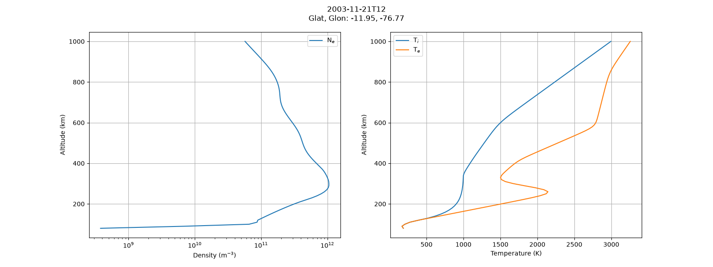
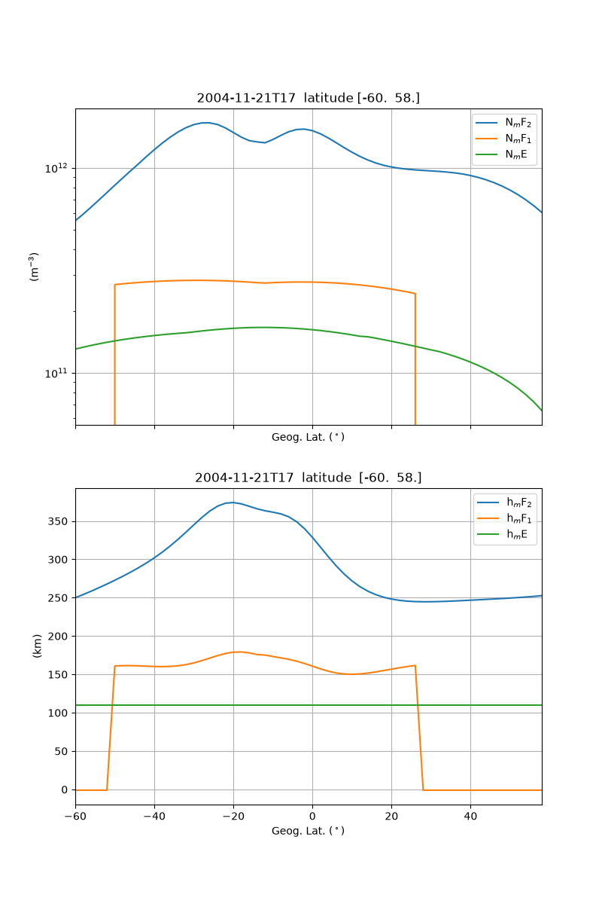
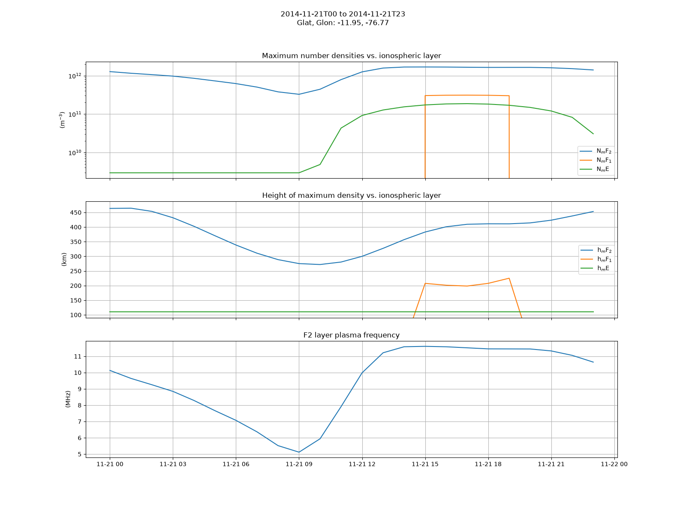
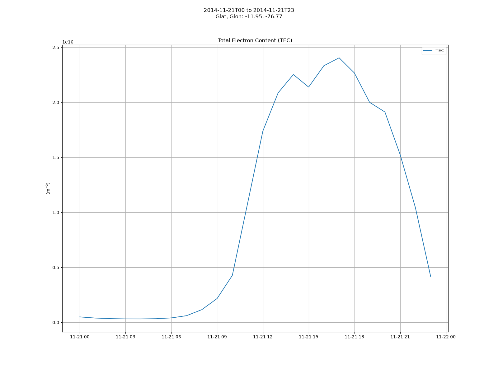

# IRI-2026 ionosphere model from Python

Python interface to the International Reference Ionosphere (IRI) **IRI-2026** model
(Fortran release from <https://irimodel.org/IRI-2026/>).
A Fortran compiler is required to build the IRI-2026 code.

This package is a port of the [iri2020](https://github.com/space-physics/iri2020) wrapper
to the IRI-2026 Fortran sources. The repository layout, the "build-on-run" CMake technique,
the command-line driver, the xarray API, the plotting scripts and the tests are kept;
the model, its data files and the tests' expected values are those of IRI-2026.
See [Authors and acknowledgements](#authors-and-acknowledgements).

The project home is <https://github.com/xnchu/iri2026> (this URL may change; it is
also set in `pyproject.toml` and `src/iri2026/CMakeLists.txt`).

## Install

Prerequisites

* Fortran compiler--any modern Fortran compiler will do. Here's how to get Gfortran:
  * Linux: `apt install gfortran`
  * Mac: `brew install gcc`
  * Windows Subsystem for Linux
* CMake >= 3.14

Install from a clone:

```sh
git clone https://github.com/xnchu/iri2026

pip install -e iri2026/
```

or with [uv](https://docs.astral.sh/uv/):

```sh
uv pip install -e "iri2026/[tests,lint]"
```

This Python wrapper of IRI-2026 uses the build-on-run technique of iri2020.
On the first `iri2026.IRI()` call the Fortran code is built into the executable
`iri2026_driver` next to the package.

If you have errors about building on the first run, ensure that your Fortran compiler is
specified in environment variable `FC`--this is what most build systems use to indicate the
desired Fortran compiler (name or full path).

## Usage

* Altitude Profile: plot density and temperatures vs altitude

  ```sh
  python -m iri2026.altitude 2003-11-21T12 -11.95 -76.77
  ```

  
* Latitude profile: plot densities and height at the peak of F2, F1, and E regions vs geographic latitude

  ```sh
  python -m iri2026.latitude 2004-11-21T17 -76.77
  ```

  
* Time profile: plot densities and height at the peak of F2, F1, and E regions vs UTC

  ```sh
  python -m iri2026.times 2014-11-21 2014-11-22 1 -11.95 -76.77
  ```

  

  

From Python:

```python
import iri2026

iono = iri2026.IRI("2015-12-13T10", (100, 1000, 10), 65.1, -147.5)
print(iono.NmF2.item(), iono.hmF2.item(), iono.foF2.item())
print(iono["ne"])  # electron density profile, m^-3
```

`iono` is an `xarray.Dataset` with the altitude profiles
`ne, Tn, Ti, Te, nO+, nH+, nHe+, nO2+, nNO+, nCI, nN+` (m^-3, K), the scalar parameters
`NmF2, hmF2, NmF1, hmF1, NmE, hmE, TEC, EqVertIonDrift, foF2` and, new in IRI-2026,
`EsProb` (sporadic-E occurrence probability, 0-1) and `BubbleProb` (IBP-2023 plasma
bubble occurrence probability, 0-1). Both probabilities are `NaN` when the model does not
apply (bubbles: daytime local time or |latitude| > 45 deg). The attributes `f107` and
`ap` hold the daily F10.7 and daily ap actually used.

### Setting JF flags

IRI has 50 [logical switches](https://irimodel.org/IRI-Switches-options.pdf) stored in the
array `JF`. The driver [iri_driver.f90](./src/iri2026/src/iri_driver.f90) uses the IRI-2026
recommended set from the comment block of `IRI_SUB` in `irisub.for`
(`jf(4,5,6,23,30,33,35,39,40,47) = .false.`, all others `.true.`) with two wrapper choices
inherited from iri2020: `jf(22) = .false.` (ion densities in m^-3 rather than percent) and
`jf(34) = .false.` (no console messages). To change a switch, edit the driver and delete
`src/iri2026/iri2026_driver` so that it is rebuilt on the next run. The IRI Working Group asks
that non-default switch settings be stated in publications.

## What's new in IRI-2026

Relative to the IRI-2020 code shipped with iri2020 (irisub.for version 2020.02), the IRI-2026
release (irisub.for 2026.04, irifun.for 2026.05) contains, from the change logs and headers
of the Fortran sources:

* **IBP-2023 plasma bubble probability model** (`IBPEMP, IBPFOU, IBPLOD`, coefficients in
  `ibp_emp_coeffs.dat`, switch `jf(38)`, output `OARR(92)` -> `BubbleProb`).
  Stolle, C., T. A. Siddiqui, L. Schreiter et al., An empirical model of the occurrence rate
  of low latitude post-sunset plasma irregularities derived from CHAMP and Swarm magnetic
  observations, Space Weather, 22, e2023SW003809, doi:10.1029/2023SW003809, 2023.
* **Sporadic-E occurrence probability** (`ESPROB`, switches `jf(45), jf(46)`, output
  `OARR(91)` -> `EsProb`): empirical spherical-harmonics model of Es occurrence from radio
  occultation data 2001-2023, optionally with F10.7 and Kp dependence.
* **New electron temperature model Te-TBPS-2026** (`ELTEO` and helpers; the IRI-2020 routine
  `ELTEIK` and its helpers were removed). Te at 310, 415, 580, 850, 1400 and 2000 km from
  satellite measurements with solar activity (PF10.7) dependence (`jf(42)`). Expect Te above
  about 350 km to differ from IRI-2020.
* **Hartley et al. (2023) plasmasphere model** (`HARDEN`, switch `jf(49)`: `.true.` = Ozhogin
  model (default), `.false.` = Hartley), plasmapause option `jf(50)`; the Ne upper boundary
  `HNEE` is now 30 000 km.
* **Ion temperature Truhlik-2021** (`jf(48)`): Truhlík, V., D. Bilitza, D. Kotov, M. Shulha,
  L. Třísková, A Global Empirical Model of the Ion Temperature in the Ionosphere for the
  International Reference Ionosphere, Atmosphere 12, 1081, doi:10.3390/atmos12081081, 2021.
* **IGRF-14 coefficients**: `dgrf2020.dat`, `igrf2025.dat`, `igrf2025s.dat` (`igrf.for`).
* Bottomside and F1 corrections in IRI-2020 versions 2020.24 / 2020.25 (Nov-Dec 2024):
  B1 limit 1.2, `HZ = 2(HF1+hst)/3`, F1 layer omitted if `NmF1 < 1.2 NmE` or
  `NmF1 > 0.8 NmF2` or `NmF1 < XE2(HEF)`, Ne(h) capped at NmF2 above hmF2. These change the
  electron density between the E and F2 peaks in some conditions.
* Fill value -1 for unused `OARR` slots. Upstream IRI-2026 writes `OARR(3)` (NmF1) at every
  daytime hour, even when the F1 layer has been omitted from the profile (F1 occurrence
  probability below 0.5 or the NmE/NmF2 consistency checks); this package restores the
  iri2020 behaviour in `patch/irisub.patch`, so NmF1 and hmF1 are -1 when there is no F1 layer.

The comparison of this package with iri2020 over 2000-2019 is documented in
[docs/comparison_iri2020.md](./docs/comparison_iri2020.md) and
[figures/compare_iri2020.png](./figures/compare_iri2020.png).

## Data files

`src/iri2026/data/` holds every file the Fortran code reads (CCIR and URSI coefficients,
Shubin hmF2 coefficients, IGRF coefficients, IBP-2023 coefficients, and the indices files).
[data/README.md](./src/iri2026/data/README.md) lists each group with its source and the
download date (2026-09-16).

`ig_rz.dat` and `apf107.dat`
([format](https://irimodel.org/indices/IRI-Format-indices-files.pdf)) are
[regularly updated](https://irimodel.org/indices/) by the IRI team. Refresh them with

```sh
python scripts/update_indices.py
```

which downloads from irimodel.org with a browser user agent (the site rejects the default
`urllib`/`curl` agent) and falls back to the daily-updated ECHAIM mirror. A date beyond the
range of `ig_rz.dat` raises `subprocess.CalledProcessError` from the driver's
`ERROR STOP IG_RZ.DAT out of date index range`.

## Local modifications of the Fortran sources

`patch/irisub.patch` stores foF2 in `OARR(100)` (as iri2020 did), initialises the bubble
probability when the IBP model is skipped, and writes NmF1 and hmF1 to `OARR(3:4)` only when
an F1 layer is present (`if(f1reg)`, as in IRI-2020; upstream IRI-2026 reports the foF1-model
value even when the layer is omitted, so NmF1 and hmF1 were inconsistent). `patch/stop.patch` replaces silent messages on
missing data files or an out-of-range date with `error stop`, and sends messages to stderr.
Everything else is the pristine IRI-2026 release; `irirtam.for` (real-time IRI) is not
included because nothing in the model calls it.

## Authors and acknowledgements

* This package was updated to IRI-2026 by **Xiangning Chu, Laboratory for Atmospheric and
  Space Physics (LASP), University of Colorado Boulder** (<xiangning.chu@lasp.colorado.edu>).
* It is derived from the [iri2020](https://github.com/space-physics/iri2020) Python/Matlab
  wrapper by Michael Hirsch and the space-physics organisation (MIT licensed,
  doi:10.5281/zenodo.240895). The wrapper design, build-on-run technique, driver, xarray API,
  plots and tests are theirs.
* The IRI model itself is developed by Dieter Bilitza and the COSPAR/URSI IRI Working Group
  (<https://irimodel.org>). Please cite Bilitza, D., M. Pezzopane, V. Truhlik, D. Altadill,
  B. W. Reinisch, A. Pignalberi, The International Reference Ionosphere model: A review and
  description of an ionospheric benchmark, Reviews of Geophysics, 60, e2022RG000792,
  doi:10.1029/2022RG000792, 2022, and the IRI-2026 release (<https://irimodel.org/IRI-2026/>),
  and follow the IRI request to state any non-default JF switches in publications.

## License

The Python wrapper, driver and build files are MIT licensed ([LICENSE](./LICENSE)).
The IRI Fortran sources and coefficient files are distributed under the IRI license,
reproduced verbatim in [LICENSE-IRI.txt](./LICENSE-IRI.txt), which requires acknowledging
the IRI Working Group and citing the paper describing the model version used.
